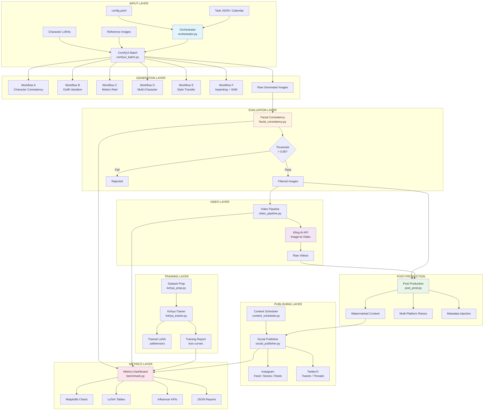

# Pipeline Architecture Diagram

## Data Flow Summary

| Stage | Input | Output | Module |
|-------|-------|--------|--------|
| Training | Raw images + config | LoRA .safetensors | `kohya_trainer.py` |
| Generation | LoRA + prompts + workflow | Raw images | `comfyui_batch.py` |
| Evaluation | Raw images | Filtered images + scores | `facial_consistency.py` |
| Video | Best images | MP4 videos | `video_pipeline.py` + `kling_api.py` |
| Post-prod | Filtered content | Watermarked + resized | `post_prod.py` |
| Scheduling | Config + characters | Editorial calendar | `content_scheduler.py` |
| Publishing | Final content + calendar | Published posts | `social_publisher.py` |
| Metrics | All stage outputs | Reports + charts + KPIs | `benchmark.py` |

## VRAM Usage Estimates (RTX 4090 24GB)

| Operation | VRAM (GB) | Duration |
|-----------|-----------|----------|
| Flux.1 dev fp8 generation | ~12.5 | 15-30s/image |
| SDXL fallback | ~6.5 | 8-15s/image |
| LoRA training (bf16, batch=1) | ~18-22 | 30-90min total |
| InsightFace evaluation | ~2 | <1s/image |
| ControlNet (single) | +1.5 | +5s/image |
| PuLID + IP-Adapter | +3-4 | +10s/image |
