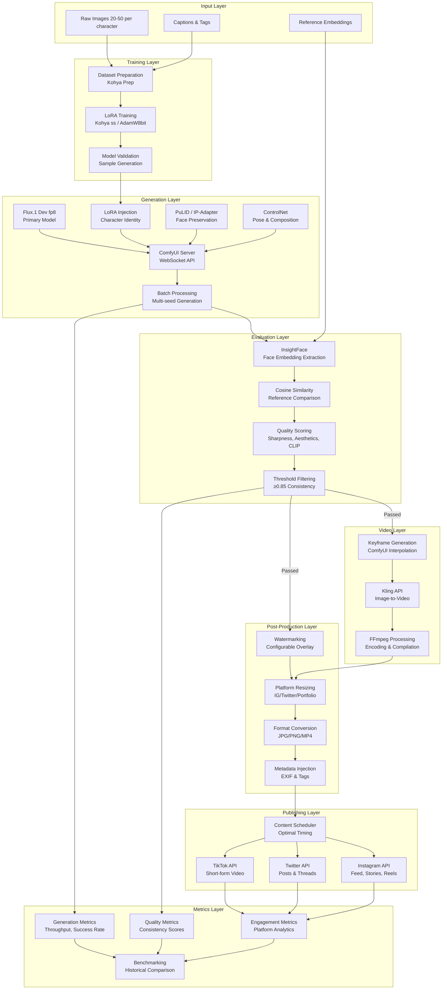
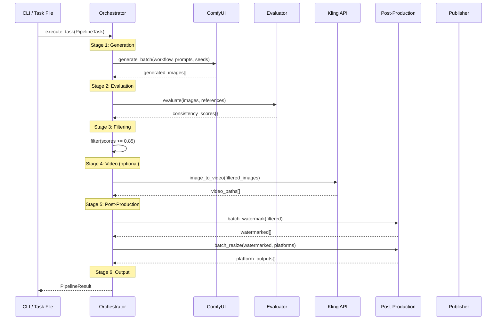
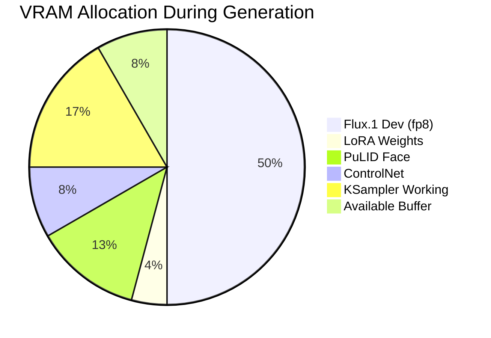
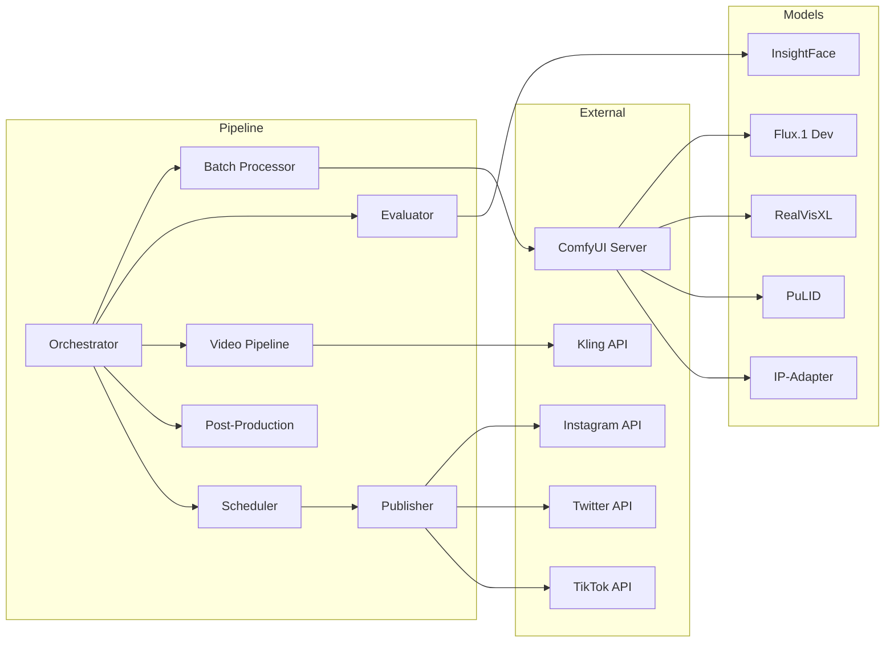

# Architecture Diagrams

## Full Pipeline Flow

## Pipeline Orchestrator Sequence

## Data Flow Table

| Stage | Input | Process | Output | VRAM |
|-------|-------|---------|--------|------|
| Dataset Prep | Raw photos (20-50) | Crop, caption, tag | Training-ready dataset | 0 GB |
| Training | Dataset + base model | Kohya LoRA training | .safetensors LoRA file | 18 GB |
| Generation | Workflow + LoRA + prompts | ComfyUI batch render | Raw images (N×seeds) | 12-16 GB |
| Face Eval | Generated + reference images | InsightFace embedding | Cosine similarity scores | 4 GB |
| Filtering | Scores + threshold | Threshold comparison | Filtered image subset | 0 GB |
| Video Gen | Filtered images + prompt | Kling I2V API | Raw video clips | 0 GB (API) |
| Post-Prod | Images/videos | Watermark + resize | Platform-ready assets | 2 GB |
| Publishing | Assets + schedule | API upload | Published content | 0 GB |
| Metrics | All stage outputs | Aggregate + analyze | Dashboard + reports | 0 GB |

## VRAM Usage Estimates (RTX 4090 - 24GB)

### Peak VRAM by Pipeline Stage

| Stage | Peak VRAM | Duration | Can Overlap |
|-------|-----------|----------|-------------|
| Training | 18 GB | 2-4 hours | No |
| Generation (Flux) | 16 GB | 30-60s/image | No |
| Generation (SDXL fallback) | 12 GB | 15-30s/image | No |
| Face Evaluation | 4 GB | 2-5s/image | Yes* |
| Video Post-Processing | 2 GB | 5-10s/video | Yes |

*Face evaluation can overlap with generation on 24GB GPU if using SDXL fallback model.

## Component Dependencies

